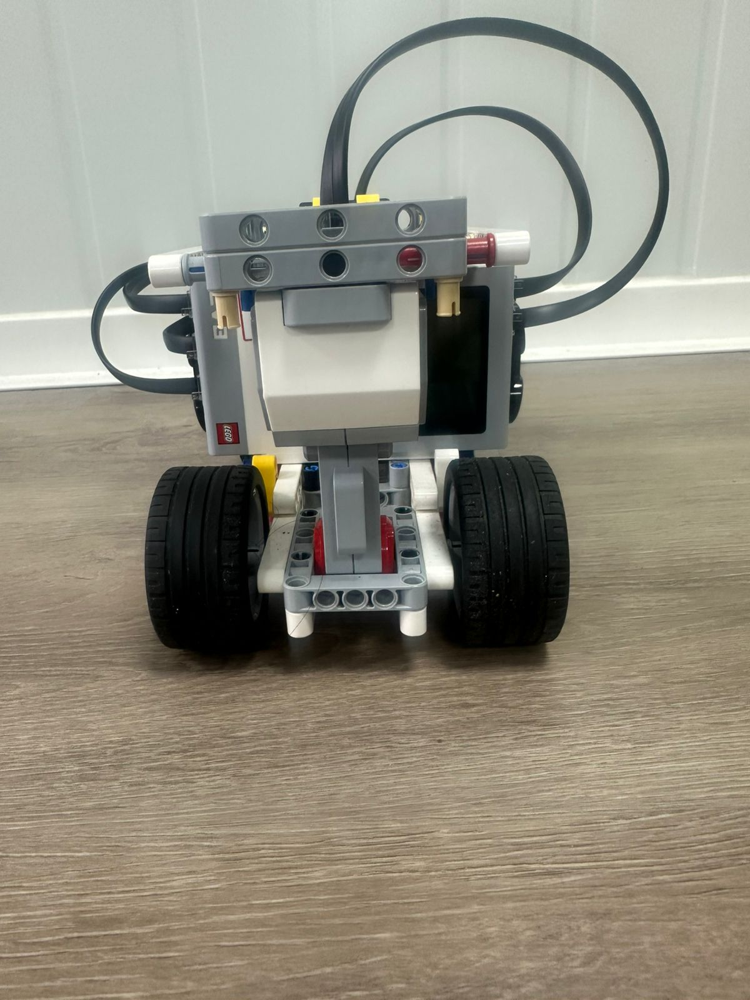
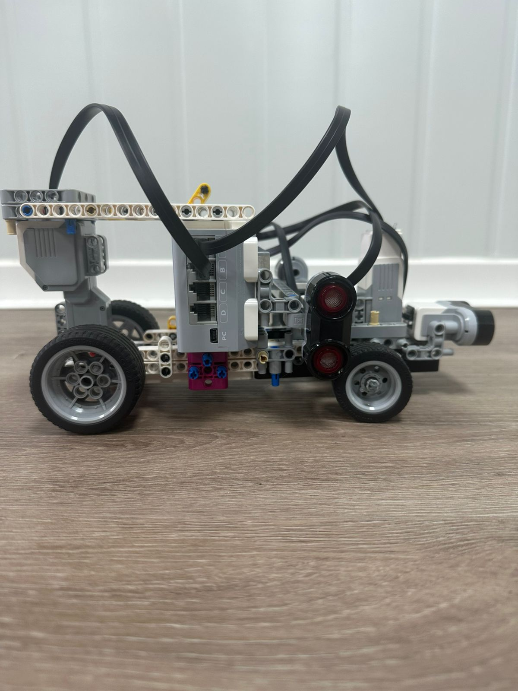

  

# WRO2026_FE_QuesoVamos
## Contents

- [Meet the Team](#meet-the-team)
- [Robot Overview](#robot-overview)
- [1. Mobility & Mechanical Design](#1-mobility--mechanical-design)
  - [Driving base & chassis](#driving-base--chassis)
  - [Motor selection & torque reasoning](#motor-selection--torque-reasoning)
  - [Steering mechanism](#steering-mechanism-ackermann)
  - [Chassis iterations](#chassis-iterations)
- [2. Power & Sensor Architecture](#2-power--sensor-architecture)
  - [Power supply & EV3 brick specs](#power-supply--ev3-brick-specs)
  - [Wiring diagram](#wiring-diagram)
  - [Sensor selection & placement](#sensor-selection--placement)
  - [Sensor calibration](#sensor-calibration)
- [3. Software Architecture](#3-software-architecture)
  - [Algorithm description](#algorithm-description)
  - [Flowchart](#flowchart)
  - [Obstacle & corner handling](#obstacle--corner-handling)
  - [Tuning process](#tuning-process)
- [4. Engineering Decisions](#4-engineering-decisions)
  - [Design decision log](#design-decision-log)
  - [What didn't work](#what-didnt-work)
- [5. Reproducibility](#5-reproducibility)
  - [Bill of Materials](#bill-of-materials)
  - [Build instructions](#build-instructions)
- [Vehicle Photos](#vehicle-photos)
- [Team Photos](#team-photos)
- [Performance Video](#performance-videos)
- [Resources](#resources)

## Meet the Team    
Welcome to the official GitHub repository for Team QuesoVamos from Panama, participating in the WRO 2026 San Miguelito Regional in the Future Engineers category, Open Challenge.

Team QuesoVamos is made up of three unlikely friends who somehow decided that building an autonomous robot, learning GitHub, using BrickLink, programming, documenting, troubleshooting, and surviving WRO all at the same time was a good idea. This is our first time working with many of these tools and technologies, so this repository is not only a place for our source code, materials, and robot documentation, but also proof of our learning process.

Even if we do not achieve something huge in this competition, our goal is to step out of our comfort zone, learn as much as possible, and use this experience to come back stronger in the future. We may be beginners now, but we are determined to improve, keep building, and go beyond what we thought we were capable of.

## Robot Overview     

Our vehicle is a four-wheeled autonomous robot built entirely from LEGO 
Mindstorms EV3 components. It uses three ultrasonic sensors for 
navigation, a large motor for drive, and a medium motor for Ackermann 
steering. Below are its physical dimensions in its final configuration.

| Specification | Value |
|---|---|
| Length | ~28 cm (280 mm) |
| Height | ~9.5 cm (95 mm) |
| Width | ~13 cm (130 mm) |
| Weight | ~73.61 g (0.07361 kg) |
| Controller | LEGO Mindstorms EV3 Brick |
| Drive motor | EV3 Large Motor (OUTPUT_B) |
| Steering motor | EV3 Medium Motor (OUTPUT_A) |
| Sensors | 3x Ultrasonic (INPUT_1, 2, 3) |
| Language | Python 3 — ev3dev2 |

## 1. Mobility & Mechanical Design   
### Driving base & chassis            

Our driving base and chassis are constructed entirely from the official LEGO Mindstorms EV3 Kit. This was decided beacuse of several technical factors we took into consideration.

First, LEGO components offer native compatibility with the EV3 brick, which reduces the difficulty of mounting sensors and motors. And second, LEGO builds allows structural issues to be identified and corrected rapidly during testing while not needing any externally sourced or 3D printed pieces.

But an all-LEGO build introduces limitations. These come in the form of the plastic frame having measurable flex at higher speeds, and connection points being able to loosen if the frame withstands powerful impacts. Despite these possible shortcomings, we still believed that we could make our car work, so we chose to build in this manner.

### Motor selection & torque reasoning 

Our vehicle uses two LEGO Mindstorms EV3 motors: one large and one medium. These are connected directly to the EV3 brick via ports A and B. Both motors were chosen for their native compatibility with the rest of out components and their ability to provide reliable speed and torque on their own.

The large motor, used for moving back and forth, has a top speed of 170 RPM, a running and stall torque of 20Nxcm and 40 Nxcm respectively, an operating voltage of 9V, and a weight of 76g. For a Lego component, these specs are very respectable and are just what we were looking for in our robot.

Finally, the medium motor, which we decided to use for steering, has a top speed of 250 RPM, a running torque of 8Nxcm, a stall torque of 12Nxcm, an operating voltage of 9V and a weight of only 36g. This motor's higher RPM and lower torque make it better suited for steering. Its low weight also helps on making our robot lighter, benefiting its speed overall.

### Steering mechanism (Ackermann)   

Our robot uses an Ackermann steering mechanism on the front axle, which 
is controlled by the EV3 medium motor. In this type of steering, the two 
front wheels turn at different angles when the robot takes a turn. The 
inner wheel turns more sharply than the outer one. This is important 
because both wheels are tracing different sized arcs at the same time, 
and if they were forced to turn at the same angle, they would drag and 
scrub against the ground instead of rolling cleanly. Ackermann geometry 
solves this by giving each wheel the correct angle for the arc it needs 
to follow.

We chose this steering system because the WRO track has four corners per 
lap, and we needed our robot to take them consistently and without losing 
control. A simpler steering setup would have caused the wheels to resist 
the turn, which could have thrown off our robot's path and made our sensor 
readings less reliable.

The medium motor controls the steering through short timed pulses in the 
code. Instead of using a sensor to track the exact wheel angle, the motor 
pushes the steering for a set amount of time and then returns it toward 
center. This kept our system simple and avoided adding extra sensors to 
our build. The push and return times were adjusted during testing until 
we found values that gave us clean, consistent turns without 
over-steering.

### Chassis iterations               

Our robot went through one major structural redesign between its first 
and final version.

In the original design, the EV3 brick was mounted vertically at the 
center of the chassis, with the sensor ports facing sideways. The two 
ultrasonic sensors were placed at the rear of the robot, pointing 
outward to the sides. This layout made the robot significantly taller 
and placed most of its weight near the back, which made it unstable 
during turns and caused the front wheels to lose grip on the track 
surface. The rear sensor placement also created a large blind spot at 
the front of the robot, since there was no sensor covering what was 
directly ahead.

For the final version, we rebuilt the chassis with the EV3 brick mounted 
horizontally, which lowered the center of gravity and made the robot more 
compact and stable. The ultrasonic sensors were moved to the sides of the 
chassis at mid-height to better align with the track walls, and a third 
sensor was added facing forward to eliminate the front blind spot. The 
overall structure became shorter and wider, which improved stability 
during both straight runs and cornering.

## 2. Power & Sensor Architecture   

For our controller and power supply, we used a standard LEGO Mindstorms 
EV3 Brick. We chose this brick because it works as both the brain and the 
battery of our robot, meaning all of our sensors and motors draw power 
directly from it without needing any external power source or voltage 
regulators.

The brick has 16 MB of flash memory, 64 MB of RAM, and outputs between 
0V and 9V depending on the component connected. Its rechargeable battery 
has a maximum capacity of 2000 mAh. To give an idea of how that capacity 
is used, our three ultrasonic sensors consume approximately 3.3V each at 
low current, and our two motors consume the most power during movement 
and recovery maneuvers. Running all five components simultaneously stays well within the brick's 
output capacity. However, during early testing sessions we experienced 
several unexpected shutdowns mid-run, not due to hardware failure, but 
because we neglected to fully charge the battery before testing. This 
taught us to treat battery management as part of our testing routine, and 
we made it a standard practice to verify battery level on the EV3 display 
before every run. After adopting this habit, we did not experience any 
further power interruptions during testing.

### Wiring diagram  

The diagram below shows how all sensors and motors connect to the EV3 
brick. Ultrasonic sensors plug into sensor ports 1, 2, and 3, while the 
medium and large motors connect to motor ports A and B respectively. All 
connections use standard LEGO Mindstorms cables with no external wiring.

### Sensor selection & placement    

For our sensor setup, we decided to use three ultrasonic sensors: one 
on the left side, one on the right side, and one at the front of the 
robot. Since we do not have a camera, these sensors are responsible for 
all of our robot's awareness of its surroundings.

We chose ultrasonic sensors over other options like infrared sensors 
because they are more reliable at measuring distance accurately and are 
less affected by lighting conditions or surface color. They are also more 
straightforward to calibrate, since their output is a direct distance 
reading in centimeters rather than a relative proximity value.

The left and right sensors are mounted at mid-chassis height on each 
side, facing perpendicular to the direction of travel. This placement 
allows them to detect the track walls consistently as the robot moves 
forward. The front sensor is mounted at the front of the chassis facing 
forward, and is responsible for detecting upcoming walls and triggering 
corner navigation. Its placement at the front of the vehicle gives the 
algorithm the maximum possible reaction distance before reaching a wall.

### Sensor calibration              

Our ultrasonic sensors do not require manual calibration in the 
traditional sense, since they output distance readings in centimeters 
directly. Instead, calibration for our robot meant finding the right 
threshold values through physical testing on a mock track.

For the side sensors, we tested different WARN distances until we found 
20 cm as the value that gave the robot enough time to correct without 
overcorrecting on straight sections. For the front sensor, we tested 
values between 35 cm and 60 cm before settling on 55 cm as the distance 
that consistently allowed the robot to begin turning before reaching the 
corner wall. These values are defined as constants at the top of our 
code and can be adjusted if the robot is used on a track with different 
wall spacing.

## 3. Software Architecture            

### Algorithm description

The vehicle's navigation software is written in Python 3 using the ev3dev2 library, and runs directly on the EV3 brick. The program follows a *priority-based threshold algorithm* — on every loop iteration, the robot reads all three ultrasonic sensors and reacts according to a strict hierarchy of conditions.

The core logic works as follows: the robot drives forward continuously while constantly polling the left (INPUT_1), front (INPUT_2), and right (INPUT_3) ultrasonic sensors. Each sensor has two distance thresholds — a *WARN* threshold that triggers a gentle steering correction while still moving, and a *CRASH* threshold that triggers a full stop and recovery sequence. Side sensors warn at 20 cm and crash at 6 cm. The front sensor warns at 55 cm and crashes at 25 cm.

A key feature of the algorithm is *turn direction locking* (TURN_DIR). The first time the robot naturally navigates a corner (front wall detected at warn range), it records whether it steered left or right and locks that direction for the entire run. Since all four corners of a WRO track share the same handedness, this guarantees that every subsequent corner and every recovery always steers the robot back into the correct lane.

Lap completion is tracked by counting corners: every time the front sensor transitions from below CORNER_ENTRY_DIST (70 cm) back above CORNER_EXIT_DIST (90 cm), one corner is counted. After every 4 corners, one lap is registered. The robot stops automatically after 3 laps.

### Flowchart                         

The following flowchart illustrates the priority-based logic our program 
follows on every cycle. The robot continuously checks four conditions in 
order. If any condition is met, it acts and restarts the loop. If none 
are met, it drives straight and stays centered until the next cycle.

.png)

> **Note:** This flowchart was generated with the assistance of AI tools 
> based entirely on our own code logic. The structure, priorities, and 
> decisions shown reflect our program exactly as written by our team.

### Obstacle & corner handling   

The main loop of our program evaluates four conditions on every cycle, 
in order of priority:

**P1 — Crash recovery:** This is the highest priority condition and it 
always fires, even during a steering cooldown. If any sensor reads below 
its crash threshold — front at 25 cm or either side at 6 cm — the robot 
stops immediately, reverses while counter-steering to swing the nose away 
from the wall, and then steers back toward the locked turn direction to 
re-enter the correct lane.

**P2 — Right wall closing:** If the right sensor reads below 20 cm and 
no crash condition is active, the robot steers left while continuing to 
move forward.

**P3 — Left wall closing:** If the left sensor reads below 20 cm and no 
crash condition is active, the robot steers right while continuing to 
move forward.

**P4 — Front wall approaching:** If the front sensor reads below 55 cm, 
the robot steers using the locked turn direction (TURN_DIR). If this is 
the first corner the robot has encountered and TURN_DIR has not been set 
yet, the robot picks the side with more open space and locks that 
direction for the rest of the run.

To avoid the robot overcorrecting repeatedly, a cooldown of 0.50 seconds 
is applied after every P2, P3, and P4 correction. P1 always bypasses 
this cooldown. Additionally, all sensor readings are passed through a 
median-of-3 filter every cycle to reduce false triggers caused by noise 
or reflections.

### Tuning process                     

The distance thresholds and timing values in our code were not chosen 
arbitrarily — they were the result of repeated physical testing on a 
mock track built to approximate the WRO layout.

Our first issue was that the robot was entering corners too late. With 
the front sensor warn threshold set to 35 cm, the robot did not have 
enough time to begin turning before it reached the wall, which caused it 
to clip the outer corner consistently. We gradually raised the threshold 
in 5 cm increments during testing until we reached 55 cm, which gave the 
robot enough advance warning to complete the turn cleanly.

Our second issue was oscillation on straight sections. In our first 
version of the loop, a correction fired every single cycle whenever a 
sensor read below its warn threshold. This caused the robot to zigzag 
continuously down the straight sections instead of holding a steady 
path. We solved this by introducing a 0.50 second cooldown after every 
correction, which gave the robot time to evaluate whether the correction 
had worked before firing another one.

Finally, the recovery behavior during back_up() was tuned after we 
noticed that the robot would sometimes reverse into the opposite wall 
after a crash. We adjusted the counter-steer direction during the 
reverse phase so the nose swings away from the wall that was hit, and 
added a second steering pulse in cases where the robot times out during 
recovery.

## 4. Engineering Decisions           

### Design decision log    

Every major component choice our team made involved weighing alternatives 
against our constraints as first-time competitors with limited experience 
and a fixed timeline. This section documents the reasoning behind our most 
significant decisions.

*EV3 over Arduino*

Early in the planning phase, we considered building the robot around an 
Arduino microcontroller, as it initially seemed like a flexible option for 
connecting multiple components. However, we quickly determined that Arduino 
was not the right fit for our team at this stage. As first-time competitors 
with no prior robotics experience, the process of wiring individual 
components, managing voltage levels, writing low-level driver code, and 
debugging hardware connections within our available time was beyond what we 
could realistically execute. The LEGO Mindstorms EV3 ecosystem offered a 
fully integrated solution — motors, sensors, brick, and software all 
designed to work together — which allowed us to focus our limited time on 
solving the actual navigation problem rather than on hardware setup.

*Three ultrasonics over two*

Our initial sensor layout used only two ultrasonic sensors on the left and 
right sides of the vehicle. During early testing we identified a blind spot 
directly in front of the robot — the side sensors could not detect a wall 
ahead until the robot was already too close to correct in time. This led us 
to add a third ultrasonic sensor facing forward, which became the primary 
trigger for corner detection and is responsible for the UF_WARN (55 cm) 
threshold that gives the robot enough time to begin steering before reaching 
the wall.

*Medium motor for steering over a servo*

We considered using a servo motor for the Ackermann steering mechanism, as 
servos are commonly used in RC car designs for precise angle control. 
However, given our fully LEGO-based chassis, integrating an external servo 
would have required custom mounting solutions and additional wiring outside 
the EV3 ecosystem. The EV3 medium motor provided sufficient steering 
response through timed pulses and remained fully compatible with our 
structure and ev3dev2 library.

### What didn't work       

*Infrared sensor as front obstacle detector*

Our original design used an infrared sensor mounted at the front of the 
robot to detect the distance between the vehicle and the wall ahead. In 
theory, the infrared sensor offered a narrower detection beam than an 
ultrasonic sensor, which we believed would reduce false positives from 
angled surfaces. In practice, the sensor performed poorly under repeated 
collision conditions — after several impacts during testing, its readings 
became inconsistent and unreliable, causing the robot to either fail to 
detect walls or trigger corrections at incorrect distances. We replaced it 
with a third ultrasonic sensor (EV3 model, INPUT_2), which proved 
significantly more robust and consistent across all testing sessions.

*Threshold-based steering without cooldown*

Our first version of the navigation loop fired a steering correction every 
single cycle whenever a sensor read below its warn threshold. This caused 
the robot to oscillate violently in straight sections — it would correct 
right, then immediately correct left on the next cycle, then right again, 
producing a zigzag pattern instead of a straight line. Introducing a 0.50 
second cooldown after each correction (STEER_COOLDOWN) resolved the 
oscillation entirely and allowed the robot to maintain a stable forward 
trajectory between corrections.

*Fixed front warn threshold of 35 cm*

Our initial front sensor warn distance was set to 35 cm. During corner 
testing, the robot consistently clipped the outer wall because it began 
steering too late — 35 cm did not give the motors enough time to turn the 
front wheels and change the vehicle's heading before the wall was reached. 
Raising the threshold to 55 cm gave the robot enough advance warning to 
complete the steering maneuver before reaching the corner wall.

## 5. Reproducibility        

### Bill of Materials

### Electronics

| Component | Model | Quantity | Purpose |
|---|---|---|---|
| EV3 Intelligent Brick | LEGO Mindstorms 45500 | 1 | Main controller & power supply |
| Large Motor | LEGO Mindstorms 45502 | 1 | Drive — rear wheels (OUTPUT_B) |
| Medium Motor | LEGO Mindstorms 45503 | 1 | Steering — front axle (OUTPUT_A) |
| Ultrasonic Sensor | LEGO Mindstorms EV3 45504 | 2 | Left (INPUT_1) & front (INPUT_2) |
| Ultrasonic Sensor | LEGO Mindstorms NXT 9846 | 1 | Right wall detection (INPUT_3) |
| EV3 Rechargeable Battery | LEGO 45501 | 1 | Power source |

### Structural elements

All structural components are sourced from the official LEGO Mindstorms 
EV3 Core Set (45544). No third-party structural parts are used. The 
complete parts list is available in models/part-list.pdf.

### Build instructions   

**Chassis**

The chassis is built entirely from LEGO Technic beams and connectors 
included in the EV3 Core Set (45544). The large motor is mounted 
longitudinally at the rear of the chassis and drives the back axle 
directly. The EV3 brick is mounted horizontally at the center of the 
chassis, serving as both the computational unit and the structural 
backbone of the vehicle.

**Steering**

The front axle uses an Ackermann steering geometry driven by the medium 
motor. The medium motor is mounted vertically above the front axle and 
connected to the steering linkage via a LEGO Technic gear. Steering 
angle is controlled by timed pulses in software rather than by position 
feedback, so no additional angle sensor is required.

**Sensor placement**

- `INPUT_1` — EV3 Ultrasonic sensor mounted on the left side of the 
chassis, facing perpendicular to the direction of travel, at 
approximately mid-chassis height.
- `INPUT_2` — EV3 Ultrasonic sensor mounted at the front of the vehicle, 
facing forward along the direction of travel.
- `INPUT_3` — NXT Ultrasonic sensor mounted on the right side of the 
chassis, facing perpendicular to the direction of travel, mirroring 
the left sensor placement.

**Software setup**

1. Install ev3dev on a microSD card following the official guide at 
[ev3dev.org](https://www.ev3dev.org/docs/getting-started/)
2. Copy `src/OC_v6.py` to the EV3 brick via SSH or the VS Code ev3dev 
extension
3. Run the program: `python3 OC_v6.py`
4. Place the robot on the track and press the center button to begin

## Vehicle Photos

| Front | Back |
|:---:|:---:|
|  |  |

| Left | Right |
|:---:|:---:|
|  |  |

| Top | Bottom |
|:---:|:---:|
|  |  |

## Team Photos

### Group photo

### Individual photos
| Romina | Caylee | Christopher |
|:---:|:---:|:---:|
|  |  |  |

## Performance Video

The following video shows our robot completing an autonomous run on the 
WRO Future Engineers open challenge track. The robot navigates using its 
three ultrasonic sensors, correcting its path in real time and counting 
corners to complete the required laps.

- [Open Challenge — Full Run](https://youtube.com/shorts/XFzVK4C4KQ8)

## Resources
- [ev3dev2 documentation](https://ev3dev-lang.readthedocs.io)
- [WRO Future Engineers 2026 rules](https://wro-association.org)
- [draw.io — flowchart tool](https://draw.io)
- [BrickLink Studio — LEGO CAD](https://www.bricklink.com/v3/studio/download.page)

  
